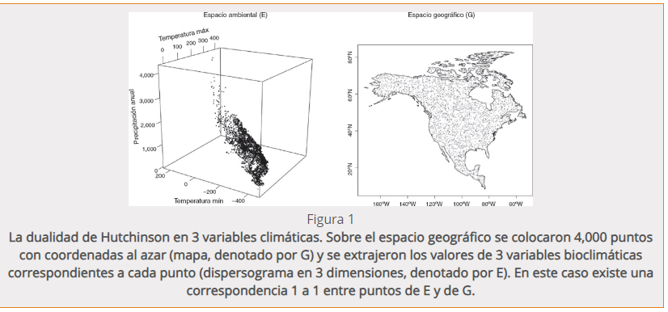

## PCB-2025-1-Bases-ecologicas-y-genomicas

## Unidad 2

### Modelos de Nicho Ecológico

**La dualidad de Hutchinson**

La nota de opinion pude ser encontrada [aqui](https://www.redalyc.org/journal/425/42551127018/html/)
