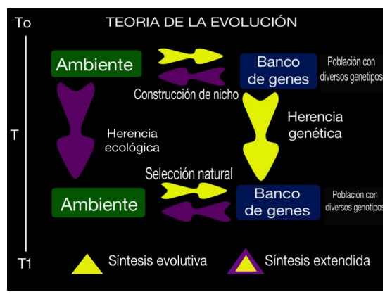
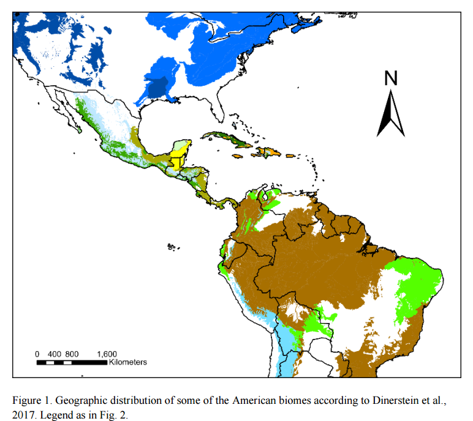
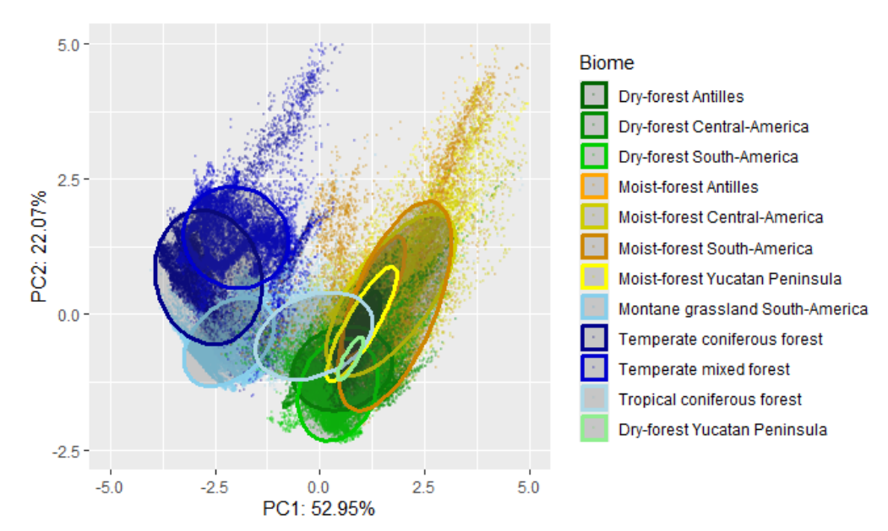

PCB \
2025-1 \
Bases ecológicas y genómicas de la interacción organismo - ambiente.

#### Unidad 2
#### Modelos de Nicho Ecológico

Algunas definiciones de nicho:

Grinell (1917): El nicho ecológico de una especie se puede definir como la combinación de condiciones ecológicas que permiten mantener a una población sin inmigración.

George Hutchinson: lo define como la suma de
todos los factores ambientales que actúan sobre un organismo.
Entonces el nicho puede ser definido
como una región en un hiperespecio de n-dimensiones. 

Charles Elton: El nicho debe describir lo que hace un animal en su comunidad, sus interacciones bióticas, los recursos que consume, su relación con el medio y como lo modifica. Por ejemplo, equivalentes ecológicos.

Lewontin, MacArthur, Levins, et al., contribuyeron a la teoría de la *construcción del nicho*. La cual está relacionada con el concepto de nicho, pero adquiere una perspectiva evolutiva. \

*Niche construction refers to the modification of selective environments by organisms. Organisms actively modify their own and each other’s evolutionary niches* ([Laland et al., 2016](https://www.ncbi.nlm.nih.gov/pmc/articles/PMC4922671/pdf/10682_2016_Article_9821.pdf)).

La nota divulgativa de donde fue tomada esta imagen en  [cienciorama](http://www.cienciorama.unam.mx/a/pdf/335_cienciorama.pdf/)

**La dualidad de Hutchinson**

La imagen fue tomada de Soberón et al., 2017. [Click aquí para ver la imagen y la nota en Revista Mexicana de Biodiversidad.](https://www.redalyc.org/journal/425/42551127018/html/)

Aquí otro ejemplo.

Como se distribuyen en el espacio geográfico algunos de los principales biomas presentes en el continente Americano. 

Como se distribuyen esos mismos biomas en el espacio ambiental con base en los dos primeros componentes de un análisis de PCA.

**Práctica 2.1.** \
Haz un ejercicio similar para una región de tu interés.\
**Nota:** Los materiales necesarios para replicar las imagenes de los biomas de américa en el espacio geográfico y ecológico se encuentran en esta misma unidad en la carpeta modelos_de_nicho_en_r. 

### Modelos de nicho ecológico

Hay una diferencia entre *modelo de distribución de especies* y *modelo de nicho ecológico* aunque a veces se emplean indistintamente. La mayoría de los métodos y algoritmos modelan el las condiciones de idoneidad para la especie y no su distribución real. [Aquí](https://www.redalyc.org/journal/425/42551127018/html/) una nota de opinión de Soberón et al., (2017), muy ilustrativa al respecto.
