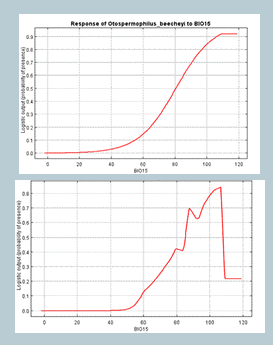

PCB \
2025-1 \
Bases ecológicas y genómicas de la interacción organismo - ambiente.

#### Unidad 2
#### Modelos de Nicho Ecológico

Algunas definiciones de nicho:

Grinell (1917): Cada especie tiene caracteristicas  fisiológicas, morfológicas y conductuales que les permite ocupar algunos ambientes.

George Hutchinson: lo define como la suma de
todos los factores ambientales que actúan sobre un organismo. Entonces el nicho puede ser definido
como una región en un hiperespecio de n-dimensiones. 

Charles Elton: El nicho debe describir lo que hace un animal en su comunidad, sus interacciones bióticas, los recursos que consume, su relación con el medio y como lo modifica. Por ejemplo, equivalentes ecológicos.

Lewontin, MacArthur, Levins, et al., contribuyeron a la teoría de la *construcción del nicho*. La cual está relacionada con el concepto de nicho, pero adquiere una perspectiva evolutiva.

*Niche construction refers to the modification of selective environments by organisms. Organisms actively modify their own and each other’s evolutionary niches* ([Laland et al., 2016](https://www.ncbi.nlm.nih.gov/pmc/articles/PMC4922671/pdf/10682_2016_Article_9821.pdf)).

 \
La nota divulgativa de donde fue tomada esta imagen en  [cienciorama](http://www.cienciorama.unam.mx/a/pdf/335_cienciorama.pdf/). SM: mutación genética, herencia mendeliana, genética de poblaciones, contingencia, especiación y tendencias. SEE: evo-devo, plasticidad y acomodación, construcción del nicho, herencia epigenética, teoría del replicador, evolvabilidad, selección a multinivel y evolución genómica.

**Ecological inheritance:** organisms can construct developmental environments for their offspring, or modify environmental states that will be experienced by other descendants.

### Modelos de nicho ecológico

**La dualidad de Hutchinson**

La imagen fue tomada de Soberón et al., 2017. [Click aquí para ver la imagen y la nota en Revista Mexicana de Biodiversidad.](https://www.redalyc.org/journal/425/42551127018/html/)

Aquí otro ejemplo.

Como se distribuyen en el espacio geográfico algunos de los principales biomas presentes en el continente Americano. 

Como se distribuyen esos mismos biomas en el espacio ambiental con base en los dos primeros componentes de un análisis de PCA.

[Artículo de discusión:](https://www.nature.com/articles/s41598-017-01313-2) *Accessible areas in ecological niche comparisons of invasive species: Recognized but still overlooked* (Qiao et al., 2017). El cual es una reinterpretación de [Febbraro et al., 2012,](https://journals.plos.org/plosone/article/file?id=10.1371/journal.pone.0066559&type=printable) quienes hacen un análisis del caso de invasión de la ardilla gris en las Islas Británicas. 

- Conceptos importantes.
- Conservadurismo de nicho vs *Niche shifts*.
- Importancia del área de calibración.

**Práctica 2.1.** \
Haz un ejercicio similar para una región de tu interés.\
**Nota:** Los materiales necesarios para replicar las imagenes de los biomas de américa en el espacio geográfico y ecológico se encuentran en esta misma unidad en la carpeta modelos_de_nicho_en_r. 

## Modelos
Discusión Artículo 2. \
Environmentally driven phenotypic convergence and niche conservatism accompany speciation in hoary bats
[(Soto‑Centeno & Simmons 2022).](https://www.nature.com/articles/s41598-022-26453-y)

Nota: sobre las diferencias entre PCA y LDA.

-  PCA is an unsupervised technique that aims to maximize the variance of the data along the principal components. 
- The goal is to identify the directions that capture the most variation in the data. 
- LDA is a supervised technique that aims to maximize the separation between different classes in the data.
- The goal is to identify the directions that capture the most separation between the classes.

[PCA vs LDA differences](https://vitalflux.com/pca-vs-lda-differences-lots-examples/) para una explicación sencilla y un ejemplo de como realizar ambos análisis en R.

### El arte de Modelar
Vamos a dar un paso atrás, qué es un modelo?
#### Parametrización:
#### Ajuste: 
#### Selección:
#### Robustez:
#### Sensibilidad:

**Práctica 2.** \
**Área de calibración:**\
Buffers / 
[ENMeval 2.0](https://jamiemkass.github.io/ENMeval/articles/ENMeval-2.0-vignette.html#select) (Kass et al., 2023.) \
Ecoregiones \
Geografía \
Dispersión / *[Grinell.](https://github.com/fmachados/grinnell)*

R package for simulation of species accessible areas (M), which can be used as calibration areas in Ecological Niche Models (ENM) and Species Distribution Models (SDM).

Los scipts para la práctica están en la carpeta modelos_de_nicho_en_r.
Para esta sesión vamos a ocupar los scripts: \
descarga_gbif \
variables_selection_niche_analyses

La parte del ejercicio referente a calibración del área de estudio (M) de acuerdo al modelo BAM (Soberón & Peterson., 2005) está basado en la página de Github *[fmachados/grinell.](https://github.com/fmachados/grinnell)*

**Práctica 3** \
Selección de variables
- No correlacionadas
- Que resuman la varianza ambiental
- Explicativas

[ENMTools:](https://nsojournals.onlinelibrary.wiley.com/doi/10.1111/j.1600-0587.2009.06142.x) a toolbox for comparative studies of environmental niche models (Warren et al., 2010). Para un excelente tutorial aquí está su página de [Github](https://github.com/danlwarren/ENMTools). 

**A variance inflation factor (VIF).**
 - A measure of multicollinearity among the independent variables in a multiple regression model.
 - Detecting multicollinearity is important because while multicollinearity does not reduce the explanatory power of the model, it does reduce the statistical significance of the independent variables. 
 - A large VIF on an independent variable indicates a highly collinear relationship to the other variables that should be considered or adjusted for in the structure of the model and selection of independent variables.

**Práctica 4**  
Limpieza de datos geográfica \
Spatial filtering to reduce sampling bias can improve the performance of ecological niche models [Boria et al., 2014](https://www.researchgate.net/publication/260014616_Spatial_filtering_to_reduce_sampling_bias_can_improve_the_performance_of_ecological_niche_models). \
[spThin](https://www.nature.com/articles/s41559-019-0972-5) (Aiello-Lammens et al 2015).

Limpieza de datos ecológica \
[Ellipsenm](https://github.com/marlonecobos/ellipsenm) (Cobos et al., 2019). \
[ntbox](https://luismurao.github.io/Instalacion_ntbox.html)
(Osorio-Olvera et al., 2020).

Reproducibilidad *A checklist for maximizing reproducibility of ecological niche models* [Feng et al., 2019](https://www.nature.com/articles/s41559-019-0972-5).

**Práctica 5** \
Calibración y selección del Modelo \
Qué es un buen modelo? \
*Let the data speaks for itself*: Si torturas suficientemente los datos, van a decir lo que quieres escuchar. \
Error del modelo.

Aquí un breve pero muy ilustrativo tutorial para [MaxEnt](https://josephgrinnell.weebly.com/exercise-tuning-maxent-using-beta-and-aic.html). \
Beta / Regularization multiplayer \
Features

\

**Comparación de Nichos** \
El más popular es [Ecospat](http://cran.nexr.com/web/packages/ecospat/ecospat.pdf). \
Basado en ellipsoides [ellipsenm](https://github.com/marlonecobos/ellipsenm) (Cobos et al., 2019).

Shoener´s D index: 

Este índice se relaciona con las pruebas 
*Niche Equivalency* y 
*Niche similarity*. Estos tests fueron propuestos en [Warren et al., 2008.](https://onlinelibrary.wiley.com/doi/10.1111/j.1558-5646.2008.00482.x)

### Transferencias en tiempo y Espacio
