**PCB** \
**2025-1** \
**Bases ecológicas y genómicas de la interacción organismo - ambiente.**

# Unidad 3
## Relación fenotipo - ambiente

### Conservadurismo filogenético de nicho

Es la tendencia que especies relacionadas presenten nichos similares (fundamental o realizado; [Pearman et al., 2008](https://pubmed.ncbi.nlm.nih.gov/18289716/)).

Conservadurismo de nicho como patrón:\
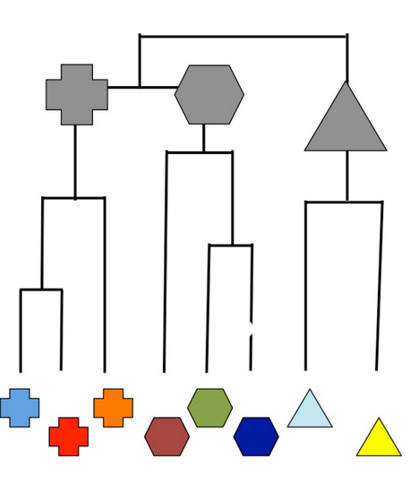

Conservadurismo de nicho como proceso:

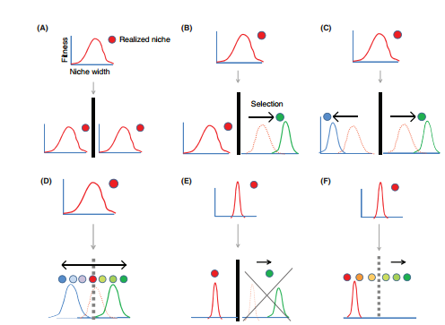

**Artículo de discusión:**\
Phylogenetic niche conservatism and the evolutionary basis of ecological speciation [Pyron et al., 2014.](https://onlinelibrary.wiley.com/doi/10.1111/brv.12154)

#### Aplicación en el filo-morfo espacio (Phylomorphospace)
A phylomorphospace allows us to consider phylogeny, disparity and tempo simultaneously [(Lloyd 2018)](https://onlinelibrary.wiley.com/doi/full/10.1111/pala.12380).\

Flujo de análisis:
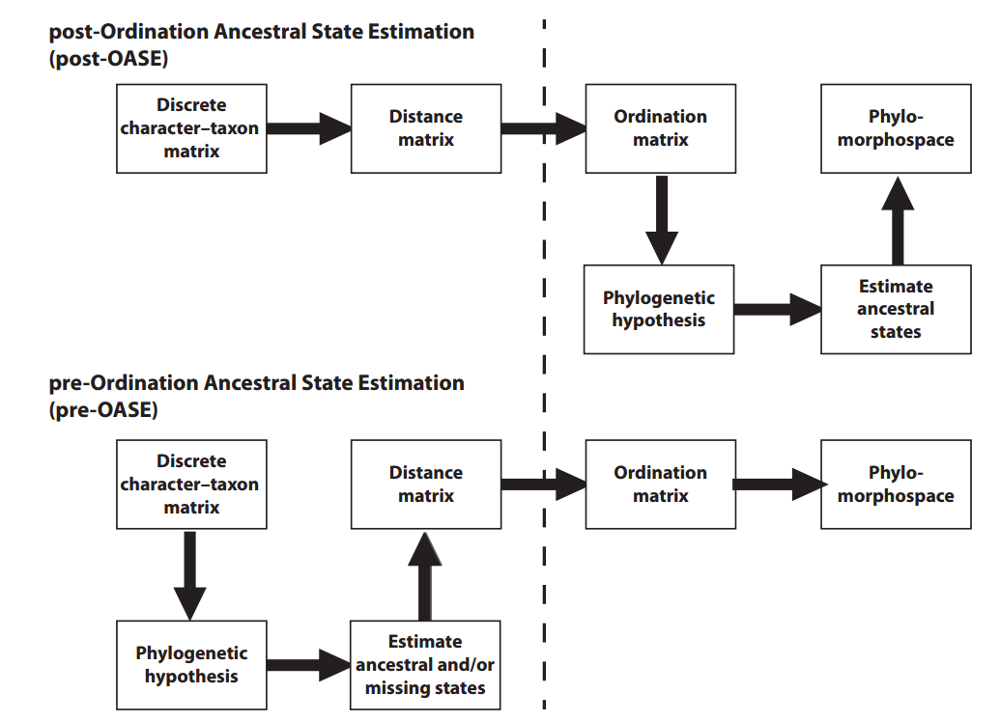

Ejemplo con osos:
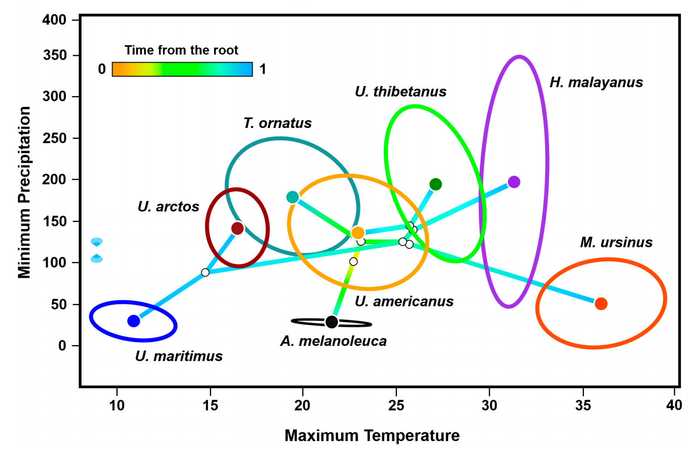

**Artículo de discusión:**\
Bears into the Niche-Space: Phylogeography and Phyloclimatic Model of the Family Ursidae
[Luna-Aranguré & Vázquez-Domínguez 2024](https://www.mdpi.com/1424-2818/16/4/223)

### Diversidad filogenética (PD)
Taxon diversity (TD) is the most quantified measure of diversity, but it gives an incomplete information because the evolutionary history underlying spatial patterns is ignored.\

Higher PD values are given to communities that has more evolutionary divergent taxa and older history, while lower PD values represent assemblages that have taxa with more recent evolutionary history.
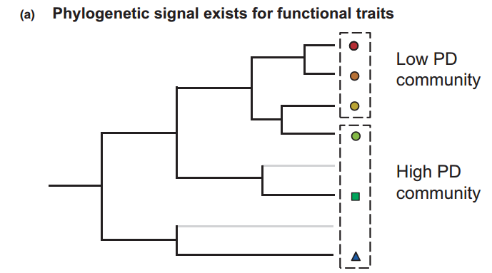

Many ecological patterns are processes are not independent of the evolution of the lineages involved in generating these patterns.
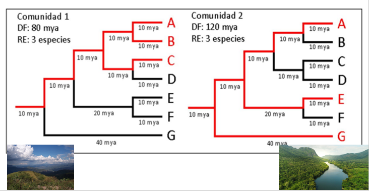

Related species often have similar functional traits, niches and ecological interactions, suggesting that phylogenetic diversity may encapsulate many of the functionally important aspects of biodiversity. Hence, PD is related to ecosystem function [Srivastava et al., 2012.](https://onlinelibrary.wiley.com/doi/10.1111/j.1461-0248.2012.01795.x)
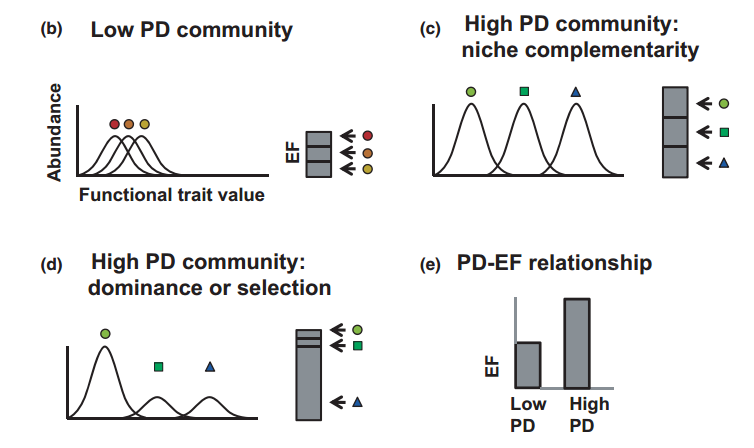

At the community level, phylogenetic clustering which is often regarded as evidence of environmental filtering, while phylogenetic overdispersion is often associated to limiting similarity. 
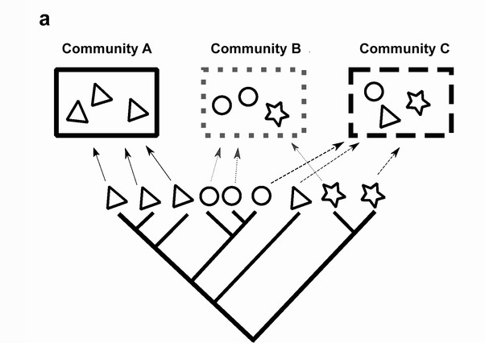

**Nota:** Nevertheless, these hypothetical links assume many ecological and evolutionary processes.

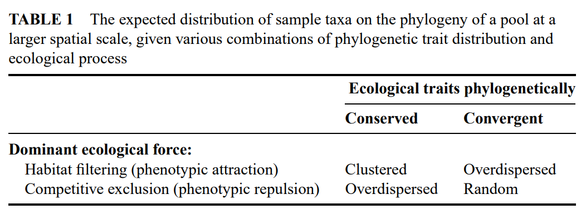\
[Webb et al., 2002.](https://www.annualreviews.org/content/journals/10.1146/annurev.ecolsys.33.010802.150448)\
When species **traits** responsible for their physiological tolerances are **conserved**, an **environmental filtering** that limits the range of viable ecological strategies at a given site is expected to select **co-occurring species more related** than expected by chance, i.e. generate a pattern known as **phylogenetic clustering**.

**Competitive exclusion** can limit the ecological similarity of co-occurring species, generating a pattern of **phylogenetic overdispersion** or **phylogenetic evenness**.

When **traits are diverging faster** across the evolutionary time, the effects of habitat filtering should be weaker, producing **evenly dispersed patterns** of relatedness.

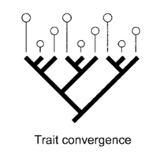

**Competition** or limiting similarity is expected to produce **random** or **clustered patterns**.

If communities are assembled independently with respect to traits (e.g., Hubbell 2001), then patterns of relatedness should be resemble random expectation.

**Artículo de discusión:**\
Phylogenetic diversity and the functioning of ecosystems [Srivastava et al., 2012.](https://onlinelibrary.wiley.com/doi/10.1111/j.1461-0248.2012.01795.x) 

Acá un excelente manual de *Community Phylogenetics in R* por [Pedro Henrique P. Braga & Katherine Hébert](https://pedrohbraga.github.io/CommunityPhylogenetics-Workshop/CommunityPhylogenetics-Workshop.html).

### Señal filogenética
Aquí la mejor explicación que encontré de  [Molina-Venegas 2023.](https://besjournals.onlinelibrary.wiley.com/doi/epdf/10.1111/2041-210X.14198) *How to get the most out of phylogenetic imputation withoutabusing it* en Methods in Ecology and Evolution.

The extent to which closely related species share similar values in the traits of interest (Blomberg et al., 2003). 

**What is a sufficiently strong phylogenetic signal?**\
Some authors assume ‘strong phylogenetic signal’ even if the traits show evolutionary trajectories that are considerably more labile than expected under Brownian motion (e.g. Liu et al., 2015).\
Others consider phylogenetic signal is strong only if trait evolution is more conserved than Brownian expectation (CaraDonna & Bain, 2016).\
The prevailing idea is that phylogenetic signal is ‘strong’ when evolutionary trajectories nearly fit Brownian motion and significantly deviate from a ‘white noise’model (i.e. pure random evolution; Münkemüller et al., 2012).

**How do we measure phylogenetic signal?**\
Phylogenetic signal is typically evaluated using the Pagels's λ model (Pagel, 1999) and/or the Blomberg's K metric (Blomberget al., 2003).\
 The λ is equal to 1 if Brownian motion fits well to the data, and less conserved evolutionary trajectories yield lower values to a minimum of 0 (complete lack of phylogenetic signal).

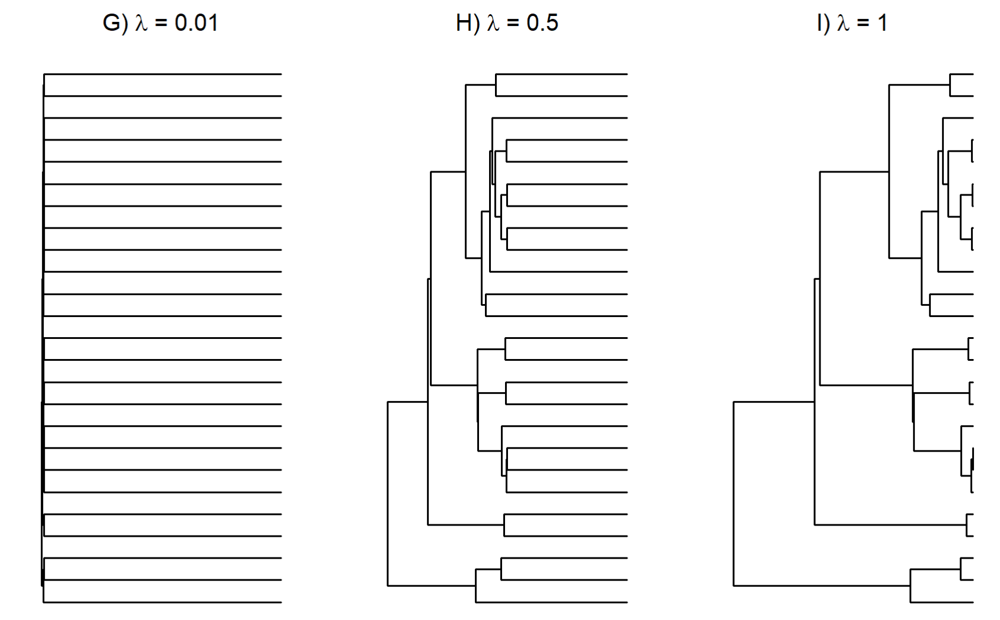

Blomberg's K **is > 1** if evolutionary trajectories are more conserved than Brownian motion.

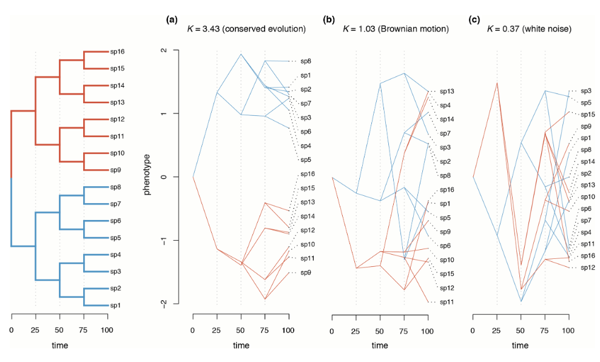

Hence both metrics provide complementary information.

**Note:** λ and K have different scales and are not directly comparable unless λ = K = 0 or λ = K = 1). 

**How do we assign the statical significance?**\
The statistical significance of λ and K is typically evaluated using randomization tests, which often results in significant signals (i.e. p < 0.05 in the randomization tests) but observed λ and K much smaller than 1 (Swenson, 2019). 
This is because the randomization approach is more akin to asking whether there is more signal than expected from a ‘white noise’ model (Münkemüller et al., 2012), a condition that can be met even with extremely labile traits (Molina-Venegas et al., 2023).

Acá otra muy buena explicación por [Liam Revell](http://blog.phytools.org/2012/03/phylogenetic-signal-with-k-and.html) y sus *Phylogenetic Tools for Comparative Biology*.

Para amarrar, un video en YouTube por [DillonTheBiologist.](https://www.google.com/search?q=phylogenetic+signal+explained&client=opera&hs=IXN&sca_esv=d4df4a45296c77b3&ei=XTnVZseyCt25wN4PgNuh0Ao&ved=0ahUKEwiH1bfUsKOIAxXdHNAFHYBtCKoQ4dUDCBA&uact=5&oq=phylogenetic+signal+explained&gs_lp=Egxnd3Mtd2l6LXNlcnAiHXBoeWxvZ2VuZXRpYyBzaWduYWwgZXhwbGFpbmVkMgUQIRigAUivIFCWCVj9HnABeAGQAQCYAb4BoAHOCaoBAzEuObgBA8gBAPgBAZgCC6AC8gnCAgoQABiwAxjWBBhHwgINEAAYgAQYsAMYQxiKBcICBxAAGIAEGBPCAggQABgTGBYYHsICChAAGBMYFhgeGA_CAgYQABgWGB7CAggQABgWGB4YD8ICCBAAGIAEGKIEmAMAiAYBkAYHkgcEMS4xMKAH9R0&sclient=gws-wiz-serp#fpstate=ive&vld=cid:bdbca419,vid:BtzM7--PK0Q,st:0)

### Diversidad y distribución
Colour polymorphism influences species’
range and extinction risk
[Takahashi & Noriyuki 2019.](https://royalsocietypublishing.org/doi/10.1098/rsbl.2019.0228#:~:text=Colour%20polymorphism%2C%20which%20is%20defined,in%20extinction%20risk%20%5B2%5D.)

